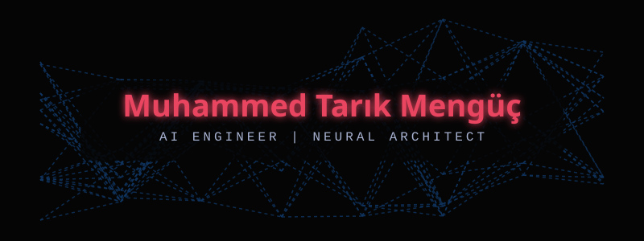

<div align="center">

<!-- Massive Hypnotic AI Core Animation -->


<!-- Animated Banner -->


<!-- Typing SVG -->
<a href="https://git.io/typing-svg">
  
</a>

<br/>

<!-- Social Badges -->
[](https://www.linkedin.com/in/muhammed-tarık-mengüç)
[](https://www.kaggle.com/mtarkmeng)
[](https://www.youtube.com/@m.tarkmenguc4631)
[](https://github.com/tarikmenguc)

</div>

---

## 🌌 About Me

```python
class TarikMenguc(AIEngineer):
    def __init__(self):
        self.name       = "Muhammed Tarık Mengüç"
        self.location   = "Turkey 🇹🇷"
        self.mission    = "Helping companies & products seamlessly integrate AI"
        self.focus      = ["LLMs", "RAG", "Fine-Tuning", "Computer Vision"]
        self.open_to    = ["AI Integration", "Consulting", "Innovative Projects"]
        self.motto      = "Decoding intelligence to build the future."
        
    def execute_mission(self):
        return "Empowering businesses through scalable AI solutions & smart architectures 🚀"
```

---

## 🧠 AI Stack & Technologies

<div align="center">

### 🤖 Artificial Intelligence & Data


### ☁️ DevOps, Cloud & Backend


</div>

---

## 📊 GitHub Analytics

<div align="center">
  
  &nbsp;
  
</div>

<div align="center">
  
</div>

<div align="center">
  
</div>

---

## 📈 Contribution Matrix

<div align="center">
  
</div>

---

<div align="center">

### 🔮 *"You have power over your mind - not outside events. Realize this, and you will find strength."* 
**— Marcus Aurelius**


</div>
